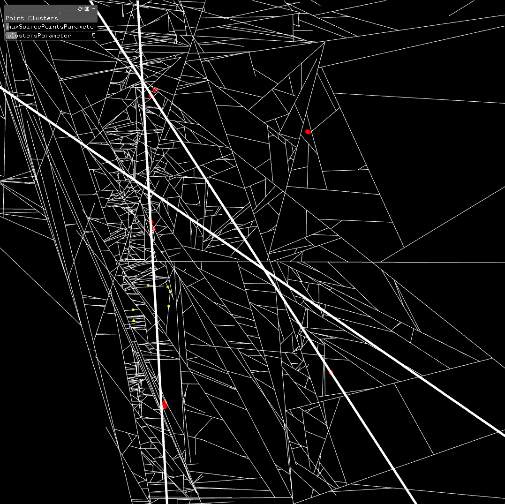

ofxDividedArea
==============

Create a sub-divided area.

Introduction
------------
Creates an area sub-divided by intersecting and non-intersecting lines.

License
-------
ofxDividedArea is distributed under the [MIT License](https://en.wikipedia.org/wiki/MIT_License). See the [LICENSE](LICENSE.md) file for further details. Just add my name somewhere along your project [Steve Meyfroidt](https://meyfroidt.com) whenever possible.

Dependencies
------------
- None

Compatibility
------------
Developed on OpenFrameworks v0.12+.
